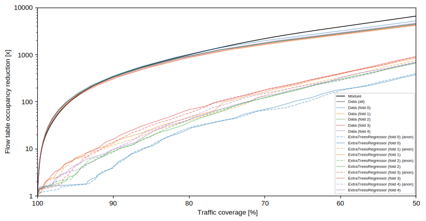

# agh_2015061019_IPv4_anon

Please cite as:

    @article{flow-models2,
        title = {flow-models 2.0: Elephant flows modeling and detection with machine learning},
        journal = {SoftwareX},
        volume = {24},
        pages = {101506},
        year = {2023},
        issn = {2352-7110},
        doi = {10.1016/j.softx.2023.101506},
        author = {Piotr Jurkiewicz}
    }

Available at: https://doi.org/10.1016/j.softx.2023.101506

This model is a subset of flows derived from the larger `agh_2015` dataset. It corresponds to a one-hour period between 19:00-20:00 UTC on Wednesday, June 10th. These flows were collected from the Internet-facing interface of the AGH University of Krakow network over a period of 30 consecutive days. The selected hour represents a typical working day with normal university operations and the presence of students in dormitories, which contributes to the majority of traffic.

We have carefully examined the network traffic during this hour and confirmed that it is free from anomalies or irregularities that may indicate unusual network activity. Furthermore, the calculated theoretical reduction rate curves of a perfect elephant detection algorithm utilizing only the first packet for this specific hour closely resemble those of the entire `agh_2015` dataset.

This model includes full flow records in a binary format. To protect privacy, the IP addresses have been anonymized using the prefix-preserving Crypto-PAn algorithm. It is worth noting that this anonymization process does not adversely affect the performance of machine learning algorithms trained on these addresses, as demonstrated in the following plot:

Dormitories, populated with nearly 8000 students, generated 86% of the traffic. The rest of the university (over 4000 employees) generated 14%. Therefore, this model can also be considered as representative of residential traffic.

In order to reproduce all steps towards creating artifacts in this repository use the following commands:

    make histograms/all
    make histograms/tcp
    make histograms/udp
    make mixtures/all
    make mixtures/tcp
    make mixtures/udp
    make plots/all
    make plots/tcp
    make plots/udp
    make summary/all
    make summary/tcp
    make summary/udp
    make series/all
    make mirror/all

To use scikit-learn to fit a regressor detecting elephant flows run the following:

    make sklearn

As a result of this command you should get a plot of flow table occupancy reduction curves, which will be saved in the [sklearn.pdf](sklearn.pdf) file.

Please consult the [Makefile](Makefile) for more details.

| Parameter           |                    Value |      Unit |
|---------------------|-------------------------:|----------:|
| Dataset name        | agh_2015061019_IPv4_anon |           |
| Flow definition     |                  5-tuple |           |
| Collection period   |                        1 |      hour |
| Exporter            |             Cisco router | (NetFlow) |
| L2 technology       |                 Ethernet |           |
| Sampling rate       |                     none |           |
| Active timeout      |                      300 |   seconds |
| Inactive timeout    |                       15 |   seconds |
| Flow records        |        included (binary) |           |
| IP Anonymization    |               Crypto-PAn |           |
|                     |                          |           |
| All traffic         |                          |           |
| Number of flows     |                6 517 484 |     flows |
| Number of packets   |              680 883 573 |   packets |
| Number of bytes     |          547 382 325 881 |     bytes |
| Average flow length |               104.470310 |   packets |
| Average flow size   |             83986.754073 |    octets |
| Average packet size |               803.929405 |     bytes |
|                     |                          |           |
| TCP-only            |                          |           |
| Number of flows     |                3 423 087 |     flows |
| Number of packets   |              552 104 410 |   packets |
| Number of bytes     |          474 938 286 477 |     bytes |
| Average flow length |               161.288454 |   packets |
| Average flow size   |            138745.607832 |    octets |
| Average packet size |               860.232735 |     bytes |
|                     |                          |           |
| UDP-only            |                          |           |
| Number of flows     |                2 982 158 |     flows |
| Number of packets   |              126 676 716 |   packets |
| Number of bytes     |           71 866 582 507 |     bytes |
| Average flow length |                42.478204 |   packets |
| Average flow size   |             24098.851405 |    octets |
| Average packet size |               567.322747 |     bytes |

|         |    TCP |    UDP | Other |
|:--------|-------:|-------:|------:|
| Flows   | 52.52% | 45.76% | 1.72% |
| Packets | 81.09% | 18.60% | 0.31% |
| Octets  | 86.76% | 13.13% | 0.11% |

|                       |         | All traffic |         |         |  TCP-only |         |         |  UDP-only |         |
|----------------------:|--------:|------------:|--------:|--------:|----------:|--------:|--------:|----------:|--------:|
| Flows of length up to |         |   Make up % |         |         | Make up % |         |         | Make up % |         |
|             (packets) |   flows |     packets |  octets |   flows |   packets |  octets |   flows |   packets |  octets |
|                       |         |             |         |         |           |         |         |           |         |
|                     1 | 44.6600 |      0.4275 |  0.0790 | 22.2955 |    0.1382 |  0.0180 | 69.3865 |    1.6335 |  0.4696 |
|                     2 | 62.8213 |      0.7752 |  0.1356 | 43.7214 |    0.4039 |  0.0531 | 84.0094 |    2.3219 |  0.6639 |
|                     4 | 73.2573 |      1.1152 |  0.2049 | 55.5880 |    0.6577 |  0.1032 | 92.8175 |    3.0146 |  0.8558 |
|                     8 | 83.3482 |      1.7094 |  0.3662 | 71.1636 |    1.2540 |  0.2643 | 96.8609 |    3.5910 |  1.0158 |
|                    16 | 90.0450 |      2.4611 |  0.6486 | 82.4340 |    2.0750 |  0.5670 | 98.5136 |    4.0407 |  1.1634 |
|                    32 | 93.9420 |      3.3139 |  1.0368 | 89.1985 |    3.0350 |  0.9922 | 99.2181 |    4.4151 |  1.3059 |
|                    64 | 96.1610 |      4.2769 |  1.5656 | 93.1293 |    4.1417 |  1.5800 | 99.5339 |    4.7445 |  1.4432 |
|                   128 | 97.4934 |      5.4319 |  2.3045 | 95.5214 |    5.4851 |  2.4042 | 99.6888 |    5.0744 |  1.6159 |
|                   256 | 98.3976 |      7.0087 |  3.4037 | 97.1420 |    7.3164 |  3.6261 | 99.7980 |    5.5377 |  1.9008 |
|                   512 | 98.9872 |      9.0311 |  4.9448 | 98.2069 |    9.6833 |  5.3492 | 99.8596 |    6.0546 |  2.2377 |
|                  1024 | 99.3490 |     11.5170 |  6.9811 | 98.8590 |   12.5857 |  7.6246 | 99.8977 |    6.6989 |  2.6882 |
|                  2048 | 99.5798 |     14.6954 |  9.7261 | 99.2694 |   16.2425 | 10.6626 | 99.9257 |    7.6596 |  3.4203 |
|                  4096 | 99.7342 |     18.9352 | 13.6503 | 99.5457 |   21.1519 | 15.0024 | 99.9432 |    8.8675 |  4.5318 |
|                  8192 | 99.8272 |     24.0211 | 18.4698 | 99.7100 |   26.9740 | 20.3145 | 99.9566 |   10.6583 |  6.0287 |
|                 16384 | 99.8861 |     30.4998 | 24.4533 | 99.8135 |   34.3410 | 26.9235 | 99.9658 |   13.2172 |  7.8455 |
|                 32768 | 99.9285 |     39.9745 | 33.6649 | 99.8865 |   44.8835 | 36.9695 | 99.9745 |   18.0058 | 11.5727 |
|                 65536 | 99.9675 |     57.4564 | 50.0111 | 99.9510 |   63.5736 | 54.1508 | 99.9853 |   30.1732 | 22.3111 |
|                131072 | 99.9901 |     76.9682 | 71.4471 | 99.9872 |   83.7145 | 76.8748 | 99.9931 |   47.2231 | 35.3720 |
|                262144 | 99.9982 |     90.2396 | 88.3221 | 99.9987 |   95.6368 | 93.7100 | 99.9977 |   66.5820 | 52.6583 |
|                524288 | 99.9994 |     94.3735 | 93.0301 | 99.9996 |   97.7148 | 96.7961 | 99.9992 |   79.9129 | 68.6075 |
|               1048576 | 99.9998 |     97.1997 | 96.1390 | 99.9999 |   98.9363 | 98.1236 | 99.9998 |   90.1205 | 83.9086 |

|                     |         | All traffic |         |         |  TCP-only |         |         |  UDP-only |         |
|--------------------:|--------:|------------:|--------:|--------:|----------:|--------:|--------:|----------:|--------:|
| Flows of size up to |         |   Make up % |         |         | Make up % |         |         | Make up % |         |
|            (octets) |   flows |     packets |  octets |   flows |   packets |  octets |   flows |   packets |  octets |
|                     |         |             |         |         |           |         |         |           |         |
|                  64 |  4.1093 |      0.0393 |  0.0031 |  5.9017 |    0.0366 |  0.0027 |  2.0674 |    0.0487 |  0.0055 |
|                 128 | 29.6298 |      0.2899 |  0.0310 | 20.3812 |    0.1332 |  0.0109 | 39.1753 |    0.9261 |  0.1557 |
|                 256 | 54.0503 |      0.6904 |  0.0804 | 42.0436 |    0.4191 |  0.0364 | 66.7667 |    1.7958 |  0.3564 |
|                 512 | 69.7169 |      1.0810 |  0.1477 | 52.5331 |    0.6528 |  0.0650 | 88.6306 |    2.8512 |  0.6748 |
|                1024 | 78.3540 |      1.4951 |  0.2225 | 63.2100 |    1.0186 |  0.1223 | 95.1010 |    3.4635 |  0.8627 |
|                2048 | 84.7399 |      2.0002 |  0.3334 | 73.0776 |    1.5335 |  0.2268 | 97.6490 |    3.9164 |  1.0109 |
|                4096 | 89.3936 |      2.6260 |  0.4923 | 80.9340 |    2.2157 |  0.3896 | 98.7600 |    4.2823 |  1.1410 |
|                8192 | 92.9653 |      3.3925 |  0.7377 | 87.2560 |    3.0833 |  0.6529 | 99.2905 |    4.5997 |  1.2651 |
|               16384 | 95.2780 |      4.3052 |  1.0552 | 91.4172 |    4.1306 |  0.9988 | 99.5605 |    4.9235 |  1.3947 |
|               32768 | 96.7557 |      5.4453 |  1.4629 | 94.1035 |    5.4511 |  1.4477 | 99.7007 |    5.2721 |  1.5277 |
|               65536 | 97.7917 |      6.9565 |  2.0351 | 95.9993 |    7.2126 |  2.0815 | 99.7840 |    5.6828 |  1.6876 |
|              131072 | 98.5048 |      8.8451 |  2.8192 | 97.2994 |    9.4029 |  2.9467 | 99.8454 |    6.2396 |  1.9250 |
|              262144 | 98.9809 |     11.1758 |  3.8686 | 98.1641 |   12.0881 |  4.1003 | 99.8890 |    6.9631 |  2.2582 |
|              524288 | 99.3227 |     14.2211 |  5.3744 | 98.7872 |   15.5766 |  5.7611 | 99.9168 |    7.9588 |  2.6867 |
|             1048576 | 99.5482 |     18.1248 |  7.3565 | 99.1990 |   20.0660 |  7.9510 | 99.9346 |    9.1590 |  3.2342 |
|             2097152 | 99.7044 |     23.5559 | 10.1099 | 99.4814 |   26.1970 | 10.9629 | 99.9506 |   11.4093 |  4.2265 |
|             4194304 | 99.8130 |     32.3039 | 13.9797 | 99.6749 |   35.7109 | 15.1310 | 99.9652 |   16.7594 |  6.0787 |
|             8388608 | 99.8835 |     42.3479 | 18.8859 | 99.7997 |   46.3077 | 20.3874 | 99.9755 |   24.3894 |  8.6103 |
|            16777216 | 99.9231 |     50.2392 | 24.4520 | 99.8684 |   53.8012 | 26.2204 | 99.9831 |   34.0220 | 12.3659 |
|            33554432 | 99.9496 |     57.1948 | 32.0267 | 99.9145 |   59.8233 | 34.2055 | 99.9882 |   45.1222 | 17.2421 |
|            67108864 | 99.9715 |     66.5112 | 44.3178 | 99.9518 |   68.7771 | 46.8669 | 99.9932 |   56.0835 | 27.0333 |
|           134217728 | 99.9883 |     77.9556 | 63.3987 | 99.9808 |   80.9007 | 66.8626 | 99.9966 |   64.8460 | 40.3072 |
|           268435456 | 99.9974 |     89.6400 | 83.6379 | 99.9964 |   93.1285 | 88.0146 | 99.9984 |   75.3357 | 54.8883 |
|           536870912 | 99.9994 |     94.8962 | 91.9017 | 99.9994 |   97.3674 | 95.3786 | 99.9993 |   84.1697 | 69.2042 |
|          1073741824 | 99.9998 |     97.5405 | 95.8234 | 99.9998 |   98.5662 | 97.4702 | 99.9999 |   93.2475 | 85.4570 |
